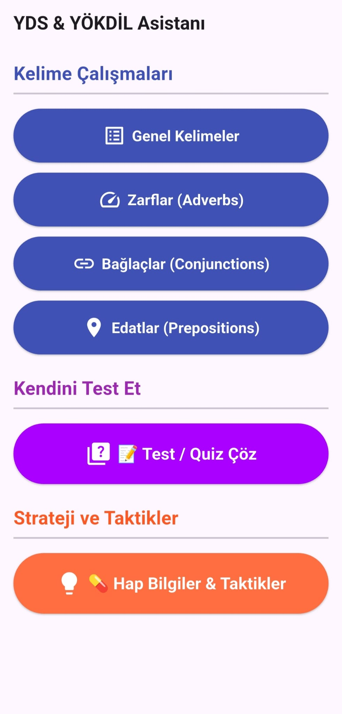
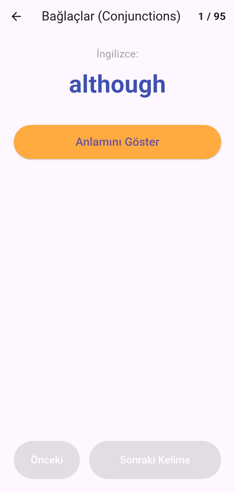
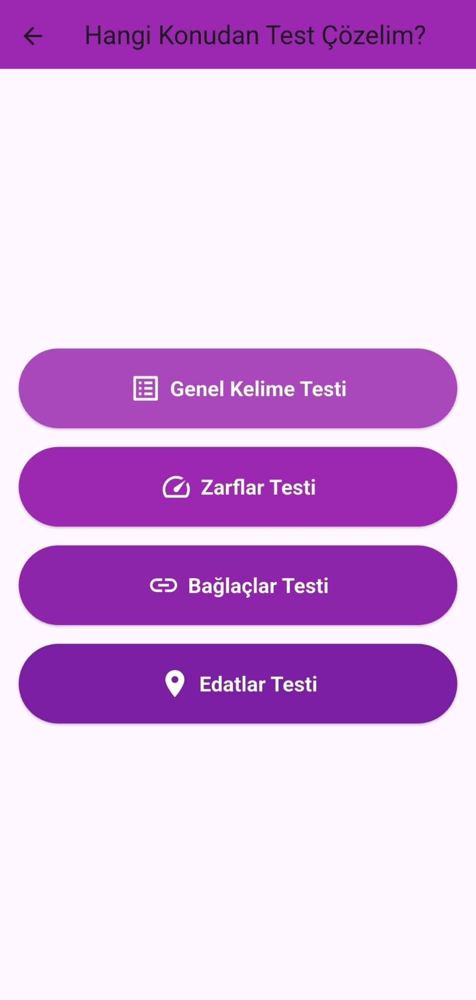
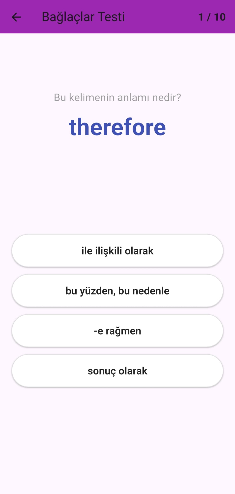
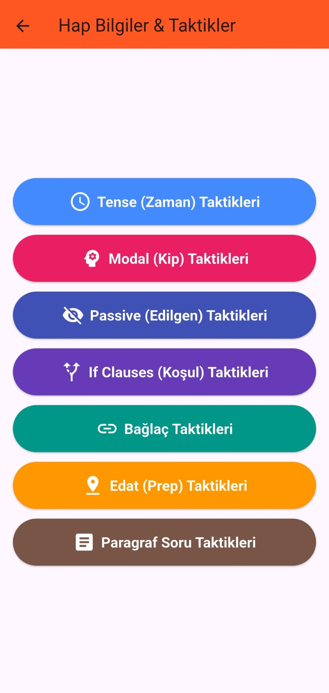
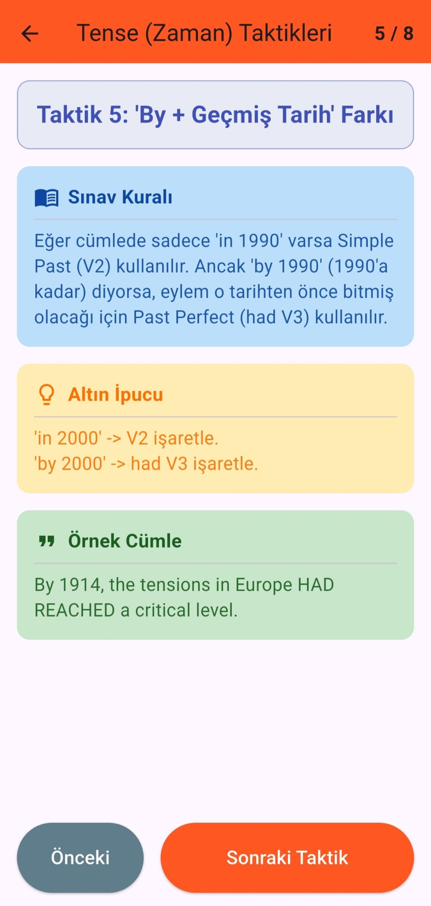

# YDS & YÖKDİL Asistanı

YDS (Yabancı Dil Sınavı) ve YÖKDİL sınavlarına hazırlık yapmak için tasarlanmış bir mobil kelime çalışma uygulaması. Bu uygulama ile kelime bilginizi geliştirebilir, çeşitli alanlardaki kelimeler öğrenebilir ve sınav hazırlığınızı hızlandırabilirsiniz.

## 📱 Özellikler

- **Geniş Kelime Veritabanı**: YDS ve YÖKDİL sınavlarında sıkça karşılaşılan kelimeler
- **Telaffuz Bilgisi**: Kelimelerin doğru nasıl okunacağını öğrenin
- **Kişiselleştirilmiş Çalışma**: Kendi hızınıza göre kelime öğrenin
- **İlerleme Takibi**: Verileriniz cihazınızda güvenli şekilde saklanır
- **Kullanıcı Dostu Arayüz**: Material Design ile tasarlanmış modern arayüz

## � Ekran Görüntüleri

<div align="center">
  
  
  
  
  
  
</div>

## �🚀 Kurulum

### 📦 Releases (Sürümler)

### 📥 En Son Sürümü İndirin

**Sürüm: v1.0.0**  
**Yayın Tarihi:** 23 Mart 2026

#### İndirme Seçenekleri:

1. **GitHub Releases Sayfasından İndir:**
   - [GitHub Releases Sayfası](https://github.com/Doxa56/yds_app/releases)
   - En son sürüme tıklayın ve APK dosyasını indirin

2. **GitHub Actions Artifacts'tan İndir (Güncel Build):**
   - Repository'ye gidin
   - **Actions** sekmesine tıklayın
   - En son başarılı workflow'a tıklayın
   - **Artifacts** bölümünden APK indirin

#### Sürüm Notları (v1.0.0):

```
🔧 Yapılan Değişiklikler:
- ✅ Loop sorunu çözüldü
- ✅ Uygulamanın genel stabil hali
```

#### Sistem Gereksinimleri:
- Android 5.0 (API Level 21) ve üzeri
- Minimum 50MB boş depolama alanı

---

### 📜 Sürüm Geçmişi

| Sürüm | Tarih | Durum |
|-------|-------|-------|
| **v1.0.0** | 23 Mart 2026 | ✅ Stabil (Mevcut) |
| v0.5.x | Önceki | ✅ Eski Sürümler |
| v0.4.x | Önceki | ✅ Eski Sürümler |
| v0.3.x | Önceki | ✅ Eski Sürümler |
| v0.2.x | Önceki | ✅ Eski Sürümler |
| v0.1.x | Önceki | ✅ Alfa |

> **Not:** Eski sürümler için [Releases](https://github.com/Doxa56/yds_app/releases) sayfasını ziyaret edin.

---

## 🚀 Kurulum

### Tek-Tıklamalı Kurulum (Önerilen)

En kolay yol, önceden hazırlanmış APK dosyasını indirmektir.

#### GitHub Actions'dan APK İndirme

APK dosyasını Android cihazınıza kurmak için adım adım şu işlemleri yapın:

1. **GitHub Repository'ye Gidin**
   - Bu projenin GitHub sayfasını açın
   - Sayfanın üst kısmında yer alan sekmelerden **"Actions"** sekmesine tıklayın

2. **En Son Build'i Bulun**
   - Actions sekmesinde, listede en yukarıdaki (en son) workflow çalıştırmasına tıklayın
   - Workflow adı genellikle "Build APK" veya "Flutter Build" şeklinde olacaktır

3. **Artifacts (Yapılar) Sekmesine Gidin**
   - Açılan sayfada en alt bölüme inin
   - **"Artifacts"** başlığı altında `app-release.apk` veya benzer bir dosya göreceksiniz

4. **APK'yı İndirin**
   - APK dosyasının üzerine tıklayarak indirme işlemini başlatın
   - İndirme tamamlandıktan sonra dosya `Downloads` klasörünüzde bulunacaktır

5. **Android Cihazınıza Kurun**
   - APK dosyasını Android telefonunuza kopyalayın veya e-posta ile gönderin
   - Dosyayı açmak için, cihazınızda **Dosyalar** (File Manager) uygulamasını açın
   - APK dosyasına basılı tutup **"Aç"** komutunu seçin veya direkt dosyaya dokunun
   - **"Bilinmeyen kaynaklardan uygulama yüklemeye izin ver"** uyarısı gelirse, **"Yükle"** butonuna tıklayın
   - Kurulum tamamlandıktan sonra **"Aç"** butonuyla uygulamayı başlatabilirsiniz

> **Not**: Android Bilinmeyen Kaynaklar ayarı hakkında merak etmeyin, bu tamamen güvenlidir. Eğer bilinmeyen kaynaklar seçeneğini bulamıyorsanız, Ayarlar > Uygulama Yönetimi > Gelişmiş Seçenekler bölümünü kontrol edin.

### Kaynak Kodundan Derleme

Geliştirici iseniz ve kodu kendi ortamınızda derlemek isterseniz:

**Gereksinimler:**
- Flutter SDK (3.0 veya daha yeni)
- Dart SDK
- Android SDK ve emülatör veya gerçek bir Android cihaz

**Adımlar:**

```bash
# Depoyu klonlayın
git clone <repository-url>
cd yds

# Bağımlılıkları yükleyin
flutter pub get

# Android APK'sı derleyin
flutter build apk --release

# Veya Debug sürümü derlemek için
flutter build apk --debug

# iOS uygulaması derlemek için (macOS gereklidir)
flutter build ios --release
```

Derlenmiş APK dosyası `build/app/outputs/flutter-apk/` klasöründe bulunacaktır.

## 📖 Kullanım

1. Uygulamayı başlatın
2. Kelime kategorisini seçin
3. Kelimeler arasında gezinerek öğrenin
4. Her kelimenin telaffuz bilgisini kullanın
5. Öğrendiğiniz kelimeleri işaretleyerek ilerlemenizi takip edin

## 📂 Proje Yapısı

```
yds/
├── assets/              # Kelime veritabanları
│   ├── words.json      # Ana kelime listesi
│   └── hap_bilgiler.json # Telaffuz bilgileri
├── lib/                # Dart kaynak kodları
│   └── main.dart       # Ana uygulama dosyası
├── android/            # Android yapılandırması
├── ios/                # iOS yapılandırması
├── web/                # Web yapılandırması
├── windows/            # Windows yapılandırması
├── linux/              # Linux yapılandırması
├── macos/              # macOS yapılandırması
└── pubspec.yaml        # İçerik ve bağımlılıklar
```

## 🛠️ Teknik Bilgiler

- **Framework**: Flutter
- **Dil**: Dart
- **Minimum Flutter Sürümü**: 3.0.0
- **Hedef Platform**: Android, iOS, Web, Windows, Linux, macOS
- **Bağımlılıklar**:
  - `shared_preferences`: Cihaz belleğinde veri saklamak için
  - `cupertino_icons`: iOS stil ikonlar

## 💾 Veri Gizliliği

- Tüm çalışma verileriniz cihazınızda yerel olarak saklanır
- Hiçbir veri sunucuya gönderilmez
- Verileriniz tamamen kendi kontrolünüz altındadır

## 📝 Lisans

Bu proje açık kaynaklıdır. Detaylar için LICENSE dosyasını kontrol edin.

## 🤝 Katkı

Bu projeyi geliştirmek ve iyileştirmek istiyorsanız:

1. Projeyi fork edin
2. Özellik dalı oluşturun (`git checkout -b feature/AmazingFeature`)
3. Değişikliklerinizi commit edin (`git commit -m 'Add some AmazingFeature'`)
4. Dalı push edin (`git push origin feature/AmazingFeature`)
5. Pull Request açın

## ❓ Sık Sorulan Sorular

**S: Yeni kelimeler nasıl eklenir?**  
C: JSON dosyalarını (`words.json` ve `hap_bilgiler.json`) düzenleyerek yeni kelimeler ekleyebilirsiniz.

**S: Uygulama internet bağlantısı gerektiriyor mu?**  
C: Hayır, uygulama tamamen çevrimdışı çalışır.

**S: Verilerim silinirse geri yükleyebilir miyim?**  
C: Verileriniz cihazın depolama alanında saklanır. Cihazı format ederseniz veriler silinir. Alternatif olarak, uygulama verilerini yedekleme özelliği kullanabilirsiniz.

## 📧 İletişim

Sorularınız veya önerileriniz için lütfen GitHub Issues sekmesini kullanarak bize ulaşın.

---

**Son Güncelleme**: Mart 2026  
**Sürüm**: 1.0.0
